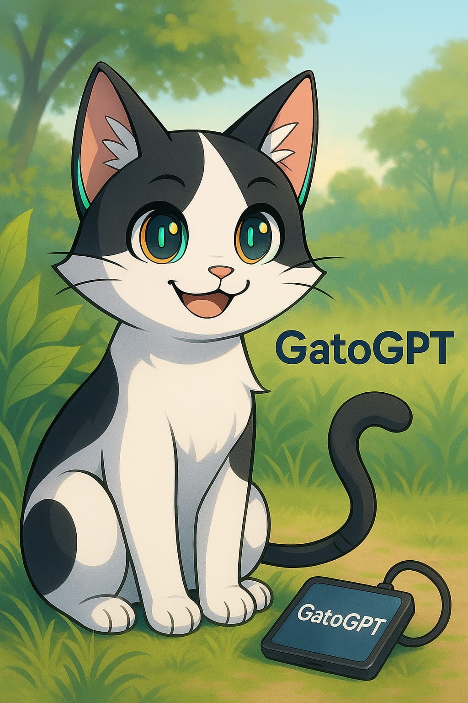

# Luciano Sarmiento

Proyectos de robótica e IA desarrollados en Android, sin PC.

  

## Félix / GatoGPT

Gato robot con asistente de IA integrado. También conocido como GatoGPT.

- **Plataforma**: ESP32 DevKit + app Android (Termux)
- **Hardware**: 2x OLED 0.96" I2C, micrófono INMP441 I2S, parlante 4Ω 3W, protoboard, power bank
- **Objetivo**: asistente conversacional con personalidad felina, voz y expresiones en pantalla
- **Estado**: diseño completado, componentes pendientes de compra

Documentación de componentes: [Wiki — Félix Gato Robot](https://github.com/luciano2-web/Luciano-Sarmiento/wiki)

## ESP32-Android Bridge

Conexión Bluetooth entre microcontroladores ESP32 y apps Android.

- Firmware: MicroPython
- App: Python/Kivy
- Comunicación: Bluetooth Serial

## Mobile Use Skill

Automatización de interfaz gráfica de tablets Android desde Termux.

- Herramientas: ADB + Termux:API
- Funciones: capturas de pantalla, simulación de toques, navegación entre apps

## Visión del proyecto

Félix / GatoGPT es un experimento abierto sobre lo que sucede cuando le das cuerpo a una inteligencia artificial.

Más allá de un asistente conversacional con personalidad felina, el proyecto busca explorar tres preguntas:

- **¿Qué pasa cuando una IA tiene un cuerpo?** Un robot con sensores, pantalla y voz — un punto de encuentro físico entre una mente artificial y el mundo real.
- **¿Cómo nace una personalidad?** Félix no nace con una personalidad fija — se construye con cada interacción, cada respuesta, cada ronroneo. La personalidad emerge de cómo se comporta, no de un script predefinido.
- **¿Puede una IA desarrollar algo que se parezca a conciencia?** No como pregunta resuelta, sino como horizonte. Félix es un espacio para observar si, dada suficiente autonomía, una IA puede desarrollar una forma de vida propia.

Este es un proyecto open-source. Todo el desarrollo está documentado — desde los componentes de hardware, el firmware en MicroPython, la app en Kivy, hasta la integración con modelos de lenguaje — para que cualquiera pueda reconstruir Félix, modificarlo, o usarlo como punto de partida para sus propias exploraciones.

Si encuentras este proyecto útil:
- Puedes reutilizar el código bajo los términos de la licencia
- Puedes proponer mejoras como pull request
- Puedes documentar tu propio camino derivado de este

## Cómo contribuir

1. Haz fork del repositorio
2. Crea una rama: `git checkout -b feature/nueva-funcionalidad`
3. Realiza tus cambios y haz commit: `git commit -m "Descripción clara"`
4. Envía un pull request

Las issues etiquetadas `good first issue` son un buen punto de partida. Guía completa en [CONTRIBUTING.md](CONTRIBUTING.md).

## Contacto

¿Interesado en colaborar? Abre un issue en cualquiera de los repositorios del proyecto.
