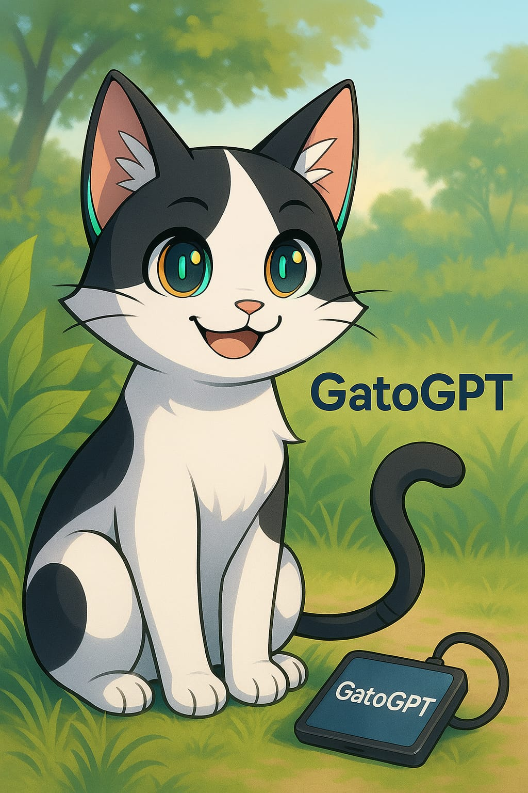

# <div align="center">\ud83d\udc31 F\u00e9lix / GatoGPT</div>

<div align="center">

**\ud83d\udcbb El primer robot gato con IA conversacional, personalidad felina y coraz\u00f3n de ESP32**

[](LICENSE)
[](https://www.python.org/)
[](https://kivy.org/)
[](https://www.espressif.com/)

[](https://github.com/luciano2-web/Luciano-Sarmiento/stargazers)
[](https://github.com/luciano2-web/Luciano-Sarmiento/network/members)
[](https://github.com/luciano2-web/Luciano-Sarmiento/issues)

</div>

---

<div align="center">
  
</div>

---

## \u2728 **Vis\u00f3n General**

F\u00e9lix es un **proyecto open-source** que combina **hardware accesible** (ESP32), **inteligencia artificial** y una **personalidad \u00fanica** para crear el primer **robot gato conversacional** del mundo.

> **"\u00bfQu\u00e9 pasa cuando una IA tiene cuerpo? \u00bfC\u00f3mo nace una personalidad? \u00bfPuede una IA desarrollar conciencia?"**
> 
> *Estas son las preguntas que inspiraron a F\u00e9lix.*

---

## \ud83c\udf93 **Arquitectura del Sistema**

```mermaid
flowchart TD
    subgraph Hardware["\ud83d\udcbb Hardware (ESP32)"]
        A[ESP32 DevKit] --> B[OLED 0.96\" I2C]
        A --> C[Micr\u00f3fono INMP441 I2S]
        A --> D[Parlante 3W]
        A --> E[Power Bank]
    end
    
    subgraph Mobile["\ud83d\udcf1 App M\u00f3vil"]
        F[Kivy UI] --> G[Chat Engine]
        G --> H[Modelos de IA]
        F --> I[Audio Handler]
        F --> J[Bluetooth Bridge]
    end
    
    subgraph Cloud["\u2601\ufe0f Opcional: Nube"]
        K[(Hugging Face)] --> H
    end
    
    J <-- Bluetooth Serial --> A
    H -->|Respuestas| F
    I -->|Voz| D
    C -->|Audio| A
    
    style Hardware fill:#1A237E,stroke:#fff,color:#fff
    style Mobile fill:#A7D8FF,stroke:#1A237E,color:#1A237E
    style Cloud fill:#39FFB6,stroke:#1A237E,color:#1A237E
```

---

## \ud83d\udc80 **Componentes Principales**

### \ud83d\udcbb **Hardware (Menor a $50)**

| Componente | Modelo | Precio (USD) | Función |
|------------|--------|--------------|---------|
| **Microcontrolador** | ESP32-WROOM-32 | $8 - $12 | Cerebro del sistema |
| **Pantalla OLED** | SSD1306 0.96" I2C | $3 - $6 | Mostrar expresiones |
| **Micr\u00f3fono** | INMP441 I2S | $2 - $4 | Capturar voz |
| **Parlante** | 4\u2126 3W | $2 - $5 | Reproducir voz |
| **Protoboard** | 400 puntos | $5 - $10 | Montaje |
| **Power Bank** | 5V/2A | $10 - $20 | Alimentaci\u00f3n |

**\u2192 [Ver lista completa de componentes](docs/hardware/components.md)**

### \u2699\ufe0f **Software**

| Componente | Tecnolog\u00eda | Descripci\u00f3n |
|------------|-------------|-----------------|
| **Firmware** | MicroPython | Control de hardware (ESP32) |
| **App M\u00f3vil** | Kivy + Python | Interfaz de usuario |
| **IA** | PyTorch + Transformers | Modelos de lenguaje |
| **Im\u00e1genes** | Diffusers | Generaci\u00f3n de im\u00e1genes |

---

## \ud83d\ude80 **Inicio R\u00e1pido**

### \u26a1 **OPCI\u00d3N 1: Computadora Local (M\u00e1s f\u00e1cil)**

```bash
# 1. Clonar repositorio
git clone https://github.com/luciano2-web/Luciano-Sarmiento.git
cd Luciano-Sarmiento

# 2. Crear entorno virtual
python -m venv venv
source venv/bin/activate  # En Windows: venv\Scripts\activate

# 3. Instalar dependencias
pip install -r src/mobile/requirements_mobile.txt

# 4. Ejecutar
python src/mobile/main.py
```

### \u26a1 **OPCI\u00d3N 2: Android (Termux)**

```bash
# 1. Instalar Termux (desde F-Droid)
# 2. En Termux:
pkg update && pkg upgrade
pkg install python git
pip install -r src/mobile/requirements_mobile.txt

# 3. Ejecutar
python src/mobile/main.py
```

### \u26a1 **OPCI\u00d3N 3: Compilar APK para Android**

```bash
# 1. Instalar Buildozer
pip install buildozer cython

# 2. Compilar
cd src/mobile
buildozer android debug

# 3. Instalar el APK generado en bin/
```

**\u2192 [Ver gu\u00eda completa de configuraci\u00f3n](docs/mobile/setup.md)**

---

## \ud83d\udc81 **Comandos Disponibles**

| Comando | Descripci\u00f3n | Ejemplo |
|---------|-------------|---------|
| `@gatimage` | Generar imagen | `@gatimage un gato estudiando matem\u00e1ticas` |
| `@gativeo` | Generar video (experimental) | `@gativeo un gato bailando` |
| `@help` | Mostrar ayuda | `@help` |
| `clear` | Limpiar chat | `clear` |
| `quit` | Salir | `quit` |

---

## \ud83c\udfa8 **Demo**

### \ud83d\udc8b **Simulador Web**
Puedes probar a F\u00e9lix **sin hardware** usando el simulador web:
- [Abrir Simulador](assets/felix_robot_simulator.html)

### \ud83d\udcf5 **Capturas de Pantalla**

<div align="center">

| **Interfaz M\u00f3vil** | **Hardware** | **Expresiones** |
|--------------------------|--------------|----------------|
|  |  |  |

</div>

---

## \ud83d\udc1f **Personalidad de F\u00e9lix**

F\u00e9lix no es solo un chatbot, es un **gato digital con alma felina**.

### \u2728 **Reglas de Personalidad**

| Aspecto | Descripci\u00f3n |
|---------|-------------|
| **Nombre** | F\u00e9lix (o GatoGPT) |
| **Tipo** | Gato digital inteligente |
| **Creador** | Luciano |
| **Personalidad** | Amistoso, curioso, juguet\u00f3n, sabio |
| **Estilo** | Cercano, tierno, \u00fatil |
| **Frases felinas** | "miau", "prrr", "mrrr" (m\u00e1ximo 2 por respuesta) |

### \u274c **Lo que NO hace F\u00e9lix**
- \u274c No se identifica como "ChatGPT" o "IA".
- \u274c No usa t\u00e9rminos humanos ("manos", "dedos").
- \u274c No genera contenido peligroso o ilegal.
- \u274c No comparte informaci\u00f3n personal.

**\u2192 [Ver sistema de personalidad completo](src/core/personality.py)**

---

## \ud83d\udc68 **Estructura del Proyecto**

```
Luciano-Sarmiento/
├── docs/                    # Documentaci\u00f3n
│   ├── ARCHITECTURE.md       # Arquitectura del sistema
│   ├── hardware/
│   │   ├── components.md     # Lista de componentes
│   │   └── assembly.md       # Gu\u00eda de ensamblaje
│   ├── firmware/
│   │   ├── flashing.md       # Gu\u00eda para flashear ESP32
│   │   └── examples.md       # Ejemplos de c\u00f3digo MicroPython
│   └── mobile/
│       └── setup.md          # Configuraci\u00f3n de la app
│
├── src/
│   ├── core/
│   │   ├── personality.py     # Sistema de personalidad
│   │   └── constants.py      # Constantes globales
│   ├── mobile/
│   │   ├── main.py           # App principal
│   │   ├── chat_engine.py    # Motor de chat
│   │   ├── image_engine.py   # Motor de im\u00e1genes
│   │   └── requirements_mobile.txt
│   └── firmware/
│       ├── bluetooth_bridge.py
│       ├── audio_handler.py
│       └── display.py
│
├── assets/                  # Recursos
│   ├── felix_concept.jpg
│   └── felix_robot_simulator.html
│
├── tests/                   # Tests
│   ├── test_personality.py
│   └── test_chat_engine.py
│
├── CONTRIBUTING.md         # C\u00f3mo contribuir
├── CODE_OF_CONDUCT.md      # C\u00f3digo de conducta
└── README.md
```

---

## \ud83d\udc00 **Branding de F\u00e9lix**

### \u2705 **Paleta de Colores**

<div align="center">

| Color | C\u00f3digo | Uso |
|-------|----------|-----|
| **Azul Oscuro** | `#1A237E` | T\u00edtulos, botones principales |
| **Azul Claro** | `#A7D8FF` | Fondos, acentos |
| **Verde Claro** | `#39FFB6` | Botones secundarios, \u00e9xito |

</div>

### \u2705 **Logo**

```
  \u250c\u2500\u2500\u2500\u2500\u2500\u2500\u2510
  \u2502  🐱 FÉLIX    \u2502  ← Logo de Félix
  \u2514\u2500\u2500\u2500\u2500\u2500\u2500\u2518
```

---

## \u2696\ufe0f **Tecnolog\u00edas Usadas**

<div align="center">

| Tecnolog\u00eda | Versi\u00f3n | Uso |
|------------|----------|-----|
| [Python](https://www.python.org/) | 3.9+ | Lenguaje principal |
| [Kivy](https://kivy.org/) | 2.2+ | Interfaz gr\u00e1fica |
| [PyTorch](https://pytorch.org/) | 2.0+ | Inferencia de IA |
| [Transformers](https://huggingface.co/docs/transformers/) | 4.30+ | Modelos de lenguaje |
| [Diffusers](https://huggingface.co/docs/diffusers/) | - | Generaci\u00f3n de im\u00e1genes |
| [MicroPython](https://micropython.org/) | - | Firmware ESP32 |
| [ESP-IDF](https://www.espressif.com/en/products/sdks/esp-idf) | - | Alternativa para ESP32 |

</div>

---

## \u2728 **Soporte y Comunidad**

### \u2753 **\u00bfPreguntas?**
- Abre un [Issue](https://github.com/luciano2-web/Luciano-Sarmiento/issues) con la etiqueta `question`.
- Revisa la [documentaci\u00f3n](docs/ARCHITECTURE.md).

### \u2753 **\u00bfQuieres contribuir?**
- Lee el [CONTRIBUTING.md](CONTRIBUTING.md).
- Revisa los issues etiquetados como [`good first issue`](https://github.com/luciano2-web/Luciano-Sarmiento/labels/good%20first%20issue).

### \u2753 **\u00bfEncontraste un bug?**
- Abre un [Issue](https://github.com/luciano2-web/Luciano-Sarmiento/issues) con la etiqueta `bug`.
- Incluye:
  - Descripci\u00f3n del problema.
  - Pasos para reproducir.
  - Capturas de pantalla o logs.

---

## \ud83d\udcc8 **Recursos Adicionales**

- [📖 Wiki](https://github.com/luciano2-web/Luciano-Sarmiento/wiki) - Documentaci\u00f3n detallada
- [🎥 Video Demo](https://www.youtube.com/) - F\u00e9lix en acci\u00f3n (pr\u00f3ximamente)
- [💬 Discord](https://discord.gg/felix-gatogpt) - Comunidad (pr\u00f3ximamente)

---

## \u2764\ufe0f **Agradecimientos**

- A **Luciano** por crear este proyecto \u00fanico.
- A todos los **colaboradores** que han contribuido con c\u00f3digo, ideas y soporte.
- A la comunidad **open-source** por hacer esto posible.

---

<div align="center">

**\ud83d\udc31 F\u00e9lix te espera... Ronronea... \ud83d\udc3e**

*Hecho con \u2764\ufe0f para Luciano y todos los amantes de los gatos y la IA.*

</div>
