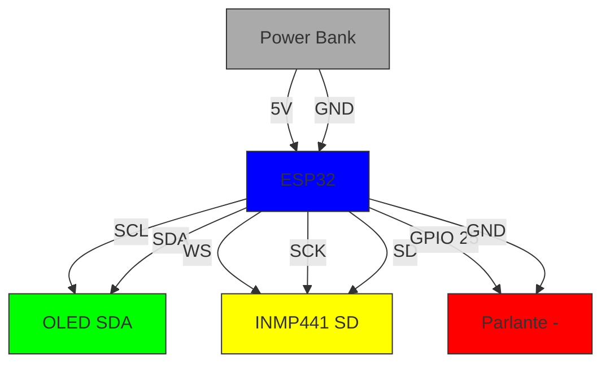
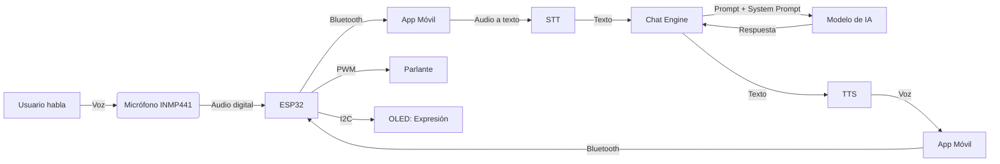
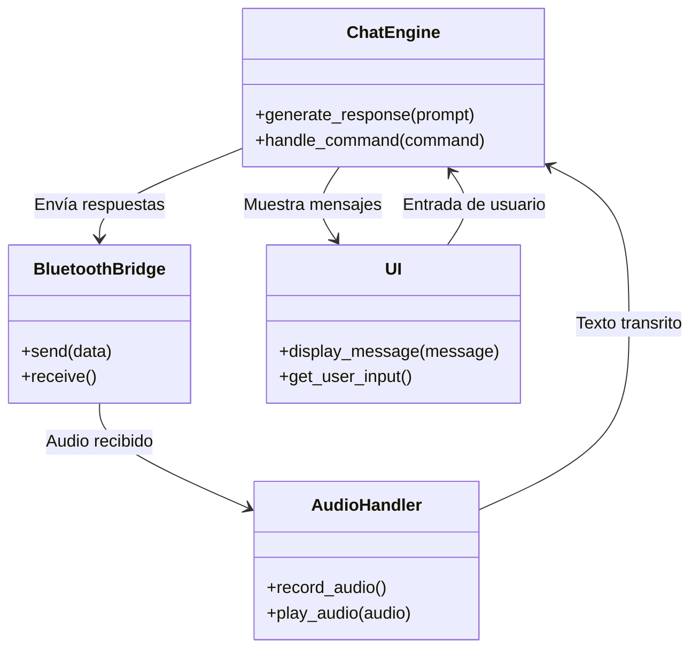

# \ud83c\udf93 Arquitectura del Sistema - F\u00e9lix / GatoGPT

**\ud83d\udc31 Versi\u00f3n: 2.0** | **\u00daltima actualizaci\u00f3n: 2024-09-28**

Este documento describe la **arquitectura completa** del proyecto F\u00e9lix, incluyendo c\u00f3mo se comunican los componentes, el flujo de datos y la organizaci\u00f3n del c\u00f3digo.

---

## \ud83c\udf0d Tabla de Contenidos
1. [Visión General](#-visión-general)
2. [Diagrama de Arquitectura](#-diagrama-de-arquitectura)
3. [Componentes Principales](#-componentes-principales)
4. [Flujo de Datos](#-flujo-de-datos)
5. [Comunicación entre Componentes](#-comunicación-entre-componentes)
6. [Estructura del Código](#-estructura-del-código)
7. [Sistema de Personalidad Unificado](#-sistema-de-personalidad-unificado)

---

## \ud83d\udc40 Visión General

F\u00e9lix es un **sistema distribuido** que combina:
- **Hardware**: ESP32 con sensores (OLED, micr\u00f3fono, parlante).
- **Firmware**: MicroPython para controlar el hardware.
- **App M\u00f3vil**: Interfaz de usuario en Kivy (Android/iOS/PC).
- **IA**: Modelos de lenguaje para generar respuestas con personalidad felina.

El sistema est\u00e1 diseñado para funcionar **sin PC**, usando solo un dispositivo Android con Snapdragon 8 Gen2 (o equivalente) y un ESP32.

---

## \ud83c\udfa8 Diagrama de Arquitectura

```mermaid
flowchart TD
    subgraph Hardware["\ud83d\udcbb Hardware (ESP32)"]
        A[ESP32 DevKit] --> B[OLED 0.96\" I2C]
        A --> C[Micr\u00f3fono INMP441 I2S]
        A --> D[Parlante 3W]
        A --> E[Power Bank]
    end
    
    subgraph Mobile["\ud83d\udcf1 App M\u00f3vil (Android/iOS/PC)"]
        F[Kivy UI] --> G[Chat Engine]
        G --> H[Modelos de IA]
        F --> I[Audio Handler]
        F --> J[Bluetooth Bridge]
    end
    
    subgraph Cloud["\u2601\ufe0f Opcional: Nube"]
        K[(Hugging Face)] --> H
        L[(Google Drive)] --> H
    end
    
    J <-- Bluetooth Serial --> A
    H -->|Respuestas| F
    I -->|Voz| D
    C -->|Audio| A
    
    style Hardware fill:#f9f,stroke:#333
    style Mobile fill:#bbf,stroke:#333
    style Cloud fill:#9f9,stroke:#333
```

---

## \ud83d\udc80 Componentes Principales

### 1. \ud83d\udcbb Hardware Layer
| Componente | Modelo | Función | Protocolo |
|------------|--------|---------|-----------|
| Microcontrolador | ESP32-WROOM-32 | Cerebro del sistema | - |
| Pantalla | OLED 0.96" SSD1306 | Mostrar expresiones de Félix | I2C |
| Micrófono | INMP441 | Capturar voz del usuario | I2S |
| Parlante | 4Ω 3W | Reproducir voz de Félix | PWM |
| Fuente de poder | Power Bank 5V | Alimentación | USB |

**Diagrama de Conexiones:**


### 2. \ud83d\udcbb Firmware Layer (MicroPython)
**Archivos clave:**
- `src/firmware/main.py` - Punto de entrada.
- `src/firmware/bluetooth_bridge.py` - Comunicación Bluetooth.
- `src/firmware/audio_handler.py` - Manejo de audio (micrófono/parlante).
- `src/firmware/display.py` - Control de la OLED.

**Responsabilidades:**
- Inicializar hardware.
- Gestionar conexión Bluetooth con la app móvil.
- Capturar audio del micrófono y enviar a la app.
- Recibir respuestas de la app y reproducir voz.
- Mostrar expresiones en la OLED.

### 3. \ud83d\udcf1 Mobile Layer (Kivy + Python)
**Archivos clave:**
- `src/mobile/main.py` - Punto de entrada de la app.
- `src/mobile/chat_engine.py` - Lógica de la IA.
- `src/mobile/audio_handler.py` - Grabación/reproducción de voz.
- `src/mobile/bluetooth_bridge.py` - Comunicación con ESP32.
- `src/mobile/ui/` - Interfaz de usuario (Kivy).

**Responsabilidades:**
- Proporcionar interfaz de chat.
- Ejecutar modelos de IA localmente.
- Manejar comandos especiales (`@gatimage`, `@gativeo`).
- Comunicarse con el ESP32 vía Bluetooth.

### 4. \u2699\ufe0f IA Layer
**Modelos usados:**
| Tarea | Modelo | Tamaño | Uso |
|-------|--------|-------|-----|
| Chat | Microsoft Phi-2 | 2.7B | Respuestas de Félix |
| Chat (ultra-ligero) | TinyLlama-1.1B | 1.1B | Dispositivos con poca RAM |
| Imágenes | SSD-1B | 1B | Generación de imágenes (`@gatimage`) |
| Video | - | - | Generación de video (`@gativeo`) |

**Características:**
- **Inferencia local**: Todos los modelos se ejecutan en el dispositivo.
- **Cuantización INT8**: Para reducir uso de memoria.
- **Cache de modelos**: Los modelos se descargan una vez y se guardan en `felix_models/`.

---

## \ud83d\udc01 Flujo de Datos

### Flujo Principal (Chat de Voz)


### Flujo de Generación de Imágenes
```mermaid
flowchart LR
    A[Usuario escribe] -->|@gatimage prompt| B[Chat Engine]
    B -->|Validar prompt| C[Modelo de Imágenes]
    C -->|Generar imagen| D[Guardar en felix_outputs/images/]
    D -->|Ruta| B
    B -->|Respuesta| A
```

---

## \ud83d\udc0d Comunicación entre Componentes

### 1. Bluetooth Serial (ESP32 ↔ App Móvil)
**Protocolo:**
- **Baud Rate**: 115200 (estándar para ESP32).
- **Formato**: JSON para mensajes estructurados.
- **Delimitador**: `\n` (nueva línea).

**Ejemplo de Mensaje (ESP32 → App):**
```json
{
    "type": "audio",
    "data": "base64_encoded_audio",
    "timestamp": 1234567890
}
```

**Ejemplo de Mensaje (App → ESP32):**
```json
{
    "type": "response",
    "text": "¡Miau! Soy Félix, tu amigo felino.",
    "emotion": "happy",
    "tts": "base64_encoded_audio"
}
```

### 2. Comunicación Interna (App Móvil)
**Patrón:** Event-Driven con Observer.


---

## \ud83d\udc1a Estructura del Código

```
Luciano-Sarmiento/
├── docs/                    # Documentación
│   ├── ARCHITECTURE.md       # Este archivo
│   ├── hardware/             # Guías de hardware
│   │   ├── components.md     # Lista de componentes
│   │   └── assembly.md       # Guía de ensamblaje
│   ├── firmware/             # Documentación del firmware
│   │   ├── flashing.md       # Cómo flashear el ESP32
│   │   └── debugging.md      # Depuración
│   ├── mobile/               # Documentación de la app móvil
│   │   ├── setup.md          # Configuración
│   │   ├── usage.md          # Uso
│   │   └── customization.md  # Personalización
│   ├── ai/                   # Documentación de IA
│   │   ├── models.md         # Modelos soportados
│   │   └── training.md        # Fine-tuning
│   └── guides/               # Guías adicionales
│       └── optimization.md   # Optimización para móviles
│
├── src/
│   ├── core/                 # Código central
│   │   ├── __init__.py
│   │   ├── personality.py     # Sistema de personalidad de Félix
│   │   └── constants.py      # Constantes globales
│   │
│   ├── firmware/             # Firmware para ESP32
│   │   ├── main.py           # Punto de entrada
│   │   ├── bluetooth_bridge.py
│   │   ├── audio_handler.py
│   │   ├── display.py        # Control de OLED
│   │   └── config.py         # Configuración del hardware
│   │
│   ├── mobile/               # App móvil
│   │   ├── main.py           # Punto de entrada
│   │   ├── chat_engine.py    # Lógica de la IA
│   │   ├── audio_handler.py  # Manejo de audio
│   │   ├── bluetooth_bridge.py
│   │   ├── config/           # Configuraciones
│   │   │   └── felix_mobile_config.yaml
│   │   ├── ui/               # Interfaz de usuario
│   │   │   ├── app.py        # App principal de Kivy
│   │   │   ├── chat_window.kv
│   │   │   └── styles.py     # Estilos
│   │   └── requirements_mobile.txt
│   │
│   └── scripts/              # Scripts auxiliares
│       ├── gatogpt_felix_colab.py
│       └── gatogpt_felix_luciano_colab.py
│
├── assets/
│   ├── images/               # Imágenes del proyecto
│   ├── diagrams/             # Diagramas
│   ├── 3d_models/            # Modelos 3D
│   ├── felix_concept.jpg    # Concepto de Félix
│   └── felix_robot_simulator.html
│
├── tests/                   # Tests
│   ├── test_personality.py  # Tests del sistema de personalidad
│   ├── test_chat_engine.py  # Tests del motor de chat
│   └── test_bluetooth.py    # Tests de comunicación
│
├── .github/                 # Configuración de GitHub
│   ├── CONTRIBUTING.md
│   ├── CODE_OF_CONDUCT.md
│   ├── ISSUE_TEMPLATE/
│   └── PULL_REQUEST_TEMPLATE.md
│
├── LICENSE
├── README.md
├── README_MOBILE.md
└── CONTRIBUTING.md
```

---

## \ud83d\udc8b Sistema de Personalidad Unificado

El **corazón** de F\u00e9lix es su **personalidad felina**, definida en `src/core/personality.py`. Este módulo garantiza que **todas las versiones** de F\u00e9lix (Colab, Mobile, etc.) tengan la misma personalidad.

### Componentes:
1. **`FELIX_SYSTEM_PROMPT`**: Prompt principal para versiones completas (Colab, PC).
2. **`FELIX_SYSTEM_PROMPT_MOBILE`**: Versión optimizada para móviles (respuestas más cortas).
3. **`FELIX_PERSONALITY_RULES`**: Reglas estructuradas para validación.
4. **`validate_felix_response()`**: Función para validar que las respuestas cumplan con las reglas.

### Ejemplo de Uso:
```python
from src.core.personality import FELIX_SYSTEM_PROMPT, validate_felix_response

# Generar respuesta con el modelo
response = model.generate(prompt, system_prompt=FELIX_SYSTEM_PROMPT)

# Validar que la respuesta sea 