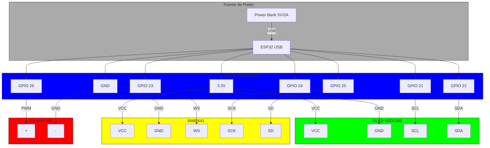

# \ud83d\udc7c Gu\u00eda de Ensamblaje de F\u00e9lix

**\ud83d\udc31 Versi\u00f3n: 2.0** | **\u00daltima actualizaci\u00f3n: 2024-09-28**

Esta gu\u00eda te llevar\u00e1 paso a paso a trav\u00e9s del **ensamblaje del hardware** de F\u00e9lix. Desde la conexi\u00f3n de los componentes hasta la prueba final.

---

## \ud83c\udf0d Tabla de Contenidos
1. [Preparaci\u00f3n](#-preparaci\u00f3n)
2. [Paso 1: Conexi\u00f3n del ESP32](#1-paso-1-conexi\u00f3n-del-esp32)
3. [Paso 2: Conexi\u00f3n de la Pantalla OLED](#2-paso-2-conexi\u00f3n-de-la-pantalla-oled)
4. [Paso 3: Conexi\u00f3n del Micr\u00f3fono INMP441](#3-paso-3-conexi\u00f3n-del-micr\u00f3fono-inmp441)
5. [Paso 4: Conexi\u00f3n del Parlante](#4-paso-4-conexi\u00f3n-del-parlante)
6. [Paso 5: Conexi\u00f3n de la Fuente de Poder](#5-paso-5-conexi\u00f3n-de-la-fuente-de-poder)
7. [Paso 6: Prueba de Conexiones](#6-paso-6-prueba-de-conexiones)
8. [Paso 7: Carga del Firmware](#7-paso-7-carga-del-firmware)
9. [Paso 8: Prueba Final](#8-paso-8-prueba-final)
10. [Soluci\u00f3n de Problemas](#-soluci\u00f3n-de-problemas)
11. [Diagrama de Conexi\u00f3n Visual](#-diagrama-de-conexi\u00f3n-visual)

---

## \ud83d\udc68 Preparaci\u00f3n

### \ud83d\udccd Materiales Necesarios
Aseg\u00farate de tener todos los componentes de la **[lista de componentes](components.md)**:
- \u2705 ESP32-WROOM-32
- \u2705 Pantalla OLED SSD1306 0.96"
- \u2705 Micr\u00f3fono INMP441
- \u2705 Parlante 4\u2126 3W
- \u2705 Protoboard de 400+ puntos
- \u2705 Cables jumper (Macho-Hembra)
- \u2705 Power Bank 5V/2A

### \ud83d\udc7c Herramientas Necesarias
- \u2705 Pinzas para cortar/pelar cables
- \u2705 Mult\u00edmetro (opcional, pero recomendado)
- \u2705 Computadora con **Arduino IDE** o **Thonny** (para cargar el firmware)
- \u2705 Cable USB para conectar el ESP32 a la computadora

### \u26a1 Recomendaciones
- Trabaja en una **superficie limpia y bien iluminada**.
- **No toques los componentes electr\u00f3nicos** con las manos h\u00famedas (pueden da\u00f1arse por electricidad est\u00e1tica).
- Usa **pulsera antiest\u00e1tica** si es posible.
- **Verifica las conexiones** dos veces antes de encender el sistema.

---

## \u2601\ufe0f Paso 1: Conexi\u00f3n del ESP32

### 1.1 Coloca el ESP32 en el Protoboard
1. Inserta el **ESP32-WROOM-32** en el protoboard.
   - Aseg\u00farate de que los pines est\u00e9n bien alineados con los agujeros del protoboard.
   - **\u26a0\ufe0f No fuerces el ESP32** al insertarlo. Si no entra f\u00e1cilmente, verifica la alineaci\u00f3n.

```
Protoboard:
+-------------------------------------+
|   |   |   |   |   |   |   |   |   |
|---+---+---+---+---+---+---+---+---|
|   |   |   |   |   |   |   |   |   |
+---+---+---+---+---+---+---+---+---+
|   |   |   |   |   |   |   |   |   |
|---+---+---+---+---+---+---+---+---|
|   |   |   | ESP32 |   |   |   |   |   |  <-- Insertar aqu\u00ed
|---+---+---+---+---+---+---+---+---|
+-------------------------------------+
```

### 1.2 Identifica los Pines del ESP32
Usar\u00e1s los siguientes pines para los componentes:

| Componente | Pin ESP32 | Tipo | Función |
|------------|-----------|------|---------|
| OLED SCL | GPIO 21 | Salida | I2C Clock |
| OLED SDA | GPIO 22 | Salida/Entrada | I2C Data |
| INMP441 WS | GPIO 23 | Salida | I2S Word Select |
| INMP441 SCK | GPIO 24 | Salida | I2S Clock |
| INMP441 SD | GPIO 25 | Entrada | I2S Data |
| Parlante | GPIO 26 | Salida | PWM |

---

## \u2601\ufe0f Paso 2: Conexi\u00f3n de la Pantalla OLED

### 2.1 Conecta la OLED al Protoboard
1. Inserta la **pantalla OLED SSD1306** en el protoboard.
   - La OLED tiene **4 pines**: VCC, GND, SCL, SDA.

2. Conecta los pines de la OLED al ESP32:
   | OLED | ESP32 |
   |------|--------|
   | VCC | 3.3V |
   | GND | GND |
   | SCL | GPIO 21 |
   | SDA | GPIO 22 |

```
OLED:
   +-----+
   | VCC |---> 3.3V (ESP32)
   | GND |---> GND (ESP32)
   | SCL |---> GPIO 21 (ESP32)
   | SDA |---> GPIO 22 (ESP32)
   +-----+
```

### 2.2 Verifica la Conexi\u00f3n
- Usa el **mult\u00edmetro** para verificar que no haya cortocircuitos entre VCC y GND.
- Aseg\u00farate de que los cables est\u00e9n **bien conectados** (puedes tirar suavemente de ellos para verificar).

---

## \u2601\ufe0f Paso 3: Conexi\u00f3n del Micr\u00f3fono INMP441

### 3.1 Conecta el INMP441 al Protoboard
1. Inserta el **micr\u00f3fono INMP441** en el protoboard.
   - El INMP441 tiene **5 pines**: VCC, GND, WS, SCK, SD.

2. Conecta los pines del INMP441 al ESP32:
   | INMP441 | ESP32 |
   |---------|--------|
   | VCC | 3.3V |
   | GND | GND |
   | WS | GPIO 23 |
   | SCK | GPIO 24 |
   | SD | GPIO 25 |

```
INMP441:
   +---------+
   | VCC     |---> 3.3V (ESP32)
   | GND     |---> GND (ESP32)
   | WS      |---> GPIO 23 (ESP32)
   | SCK     |---> GPIO 24 (ESP32)
   | SD      |---> GPIO 25 (ESP32)
   +---------+
```

### 3.2 Notas Importantes
- El INMP441 **requiere 3.3V** (no 5V).
- Aseg\u00farate de que los cables est\u00e9n **bien aislados** para evitar interferencias.

---

## \u2601\ufe0f Paso 4: Conexi\u00f3n del Parlante

### 4.1 Conecta el Parlante al Protoboard
1. Conecta el **parlante 4\u2126 3W** al protoboard:
   - El parlante tiene **2 cables**: positivo (+) y negativo (-).

2. Conecta los cables del parlante al ESP32:
   | Parlante | ESP32 |
   |----------|--------|
   | + | GPIO 26 |
   | - | GND |

```
Parlante:
   +--------+
   | +      |---> GPIO 26 (ESP32)
   | -      |---> GND (ESP32)
   +--------+
```

### 4.2 Notas Importantes
- El ESP32 puede **no tener suficiente potencia** para el parlante de 3W. Si el sonido es d\u00e9bil, considera usar un **amplificador de audio** (como el PAM8403).
- Si usas un amplificador, conecta el parlante al amplificador y el amplificador al ESP32.

---

## \u2601\ufe0f Paso 5: Conexi\u00f3n de la Fuente de Poder

### 5.1 Conecta el Power Bank
1. Conecta el **Power Bank** al ESP32:
   - Usa un **cable USB** para conectar el Power Bank al puerto **USB del ESP32**.

```
Power Bank:
   +---------+
   | USB     |---> ESP32 USB
   +---------+
```

### 5.2 Notas Importantes
- El Power Bank debe proporcionar **5V/2A** (m\u00ednimo).
- **No uses una fuente de poder que proporcione m\u00e1s de 5V** (puede da\u00f1ar el ESP32).
- Si el Power Bank tiene un **interruptor**, enci\u00endelo.

---

## \u2601\ufe0f Paso 6: Prueba de Conexiones

### 6.1 Verifica Visualmente
- Revisa que **todos los cables est\u00e9n bien conectados**.
- Aseg\u00farate de que **no haya cables sueltos** que puedan causar cortocircuitos.

### 6.2 Prueba con Mult\u00edmetro
1. Configura el mult\u00edmetro en modo **continuidad** (o resistencia).
2. Verifica que:
   - No haya continuidad entre **VCC y GND** (debe mostrar **OL** o resistencia infinita).
   - No haya continuidad entre **cualquier pin de datos y GND** (debe mostrar **OL**).

### 6.3 Prueba de Encendido
1. Conecta el **Power Bank al ESP32**.
2. El **LED rojo** del ESP32 debe encenderse (indica que est\u00e1 recibiendo poder).
3. Si el LED **no enciende**:
   - Verifica la conexi\u00f3n del Power Bank.
   - Prueba con otro cable USB.
   - Prueba con otra fuente de poder (ej: puerto USB de una computadora).

---

## \u2601\ufe0f Paso 7: Carga del Firmware

### 7.1 Instala las Herramientas Necesarias
1. **Arduino IDE**: Desc\u00e1rgala de [arduino.cc](https://www.arduino.cc).
   - Instala el soporte para ESP32:
     - Ve a **File > Preferences**.
     - En **Additional Boards Manager URLs**, agrega:
       ```
       https://raw.githubusercontent.com/espressif/arduino-esp32/gh-pages/package_esp32_index.json
       ```
     - Ve a **Tools > Board > Boards Manager**, busca **esp32** e instala.

2. **Thonny** (alternativa para MicroPython):
   - Desc\u00e1rgala de [thonny.org](https://thonny.org).
   - Instala el plugin para ESP32.

### 7.2 Carga el Firmware
1. Conecta el **ESP32 a tu computadora** usando un cable USB.
2. Abre el **Arduino IDE** o **Thonny**.
3. Selecciona el **ESP32 Dev Module** como board:
   - En Arduino IDE: **Tools > Board > ESP32 Arduino > ESP32 Dev Module**.
   - En Thonny: **Run > Select interpreter > MicroPython (ESP32)**.

4. Selecciona el **puerto COM** correcto:
   - En Arduino IDE: **Tools > Port > COMX** (donde X es el n\u00famero de puerto).
   - En Thonny: **Run > Select port > COMX**.

5. Abre el archivo de firmware (`src/firmware/main.py`) y c\u00e1rgalo al ESP32.

---

## \u2601\ufe0f Paso 8: Prueba Final

### 8.1 Prueba la OLED
1. El firmware debe **inicializar la OLED** y mostrar un mensaje de bienvenida.
2. Si la OLED **no muestra nada**:
   - Verifica las conexiones **I2C** (SCL y SDA).
   - Aseg\u00farate de que la OLED est\u00e9 **bien conectada** al protoboard.
   - Prueba con otro **cable jumper**.

### 8.2 Prueba el Bluetooth
1. Usa tu **tel\u00e9fono** para buscar dispositivos Bluetooth.
2. El ESP32 debe aparecer como **"F\u00e9lix"** o **"ESP32"**.
3. Con\u00e9ctate al ESP32 usando la app m\u00f3vil de F\u00e9lix.
4. Si el Bluetooth **no funciona**:
   - Verifica que el **firmware est\u00e9 cargado correctamente**.
   - Reinicia el ESP32.

### 8.3 Prueba el Micr\u00f3fono y Parlante
1. Habla cerca del **micr\u00f3fono INMP441**.
2. La app m\u00f3vil debe **recibir el audio** y convertirlo a texto.
3. F\u00e9lix debe **responder** y el parlante debe reproducir su voz.
4. Si el audio **no funciona**:
   - Verifica las conexiones **I2S** (WS, SCK, SD).
   - Aseg\u00farate de que el **micr\u00f3fono est\u00e9 bien conectado**.
   - Prueba con otro **micr\u00f3fono**.

---

## \u26a0\ufe0f Soluci\u00f3n de Problemas

### \ud83d\udca5 La OLED no enciende
| Problema | Causa | Soluci\u00f3n |
|----------|-------|----------|
| No hay imagen | Conexi\u00f3n I2C incorrecta | Verifica SCL (GPIO 21) y SDA (GPIO 22) |
| Pantalla en blanco | OLED defectuosa | Prueba con otra OLED |
| Pantalla con caracteres raros | Voltaje incorrecto | Usa 3.3V (no 5V) |

### \ud83d\udce1 Bluetooth no funciona
| Problema | Causa | Soluci\u00f3n |
|----------|-------|----------|
| No aparece el ESP32 | Firmware no cargado | Recarga el firmware |
| Conexi\u00f3n falla | Distancia | Ac\u00e9rcate el tel\u00e9fono al ESP32 |
| Conexi\u00f3n se corta | Interferencias | Aleja otros dispositivos Bluetooth |

### \ud83d\udcb6 Audio no funciona
| Problema | Causa | Soluci\u00f3n |
|----------|-------|----------|
| No se graba audio | Conexi\u00f3n I2S incorrecta | Verifica WS, SCK, SD |
| Sonido distorsionado | Parlante de baja calidad | Prueba con otro parlante |
| Sonido muy bajo | Falta amplificador | Usa un amplificador PAM8403 |

---

## \ud83c\udfa8 Diagrama de Conexi\u00f3n Visual



---

## \ud83d\udc81 Consejos Finales

1. **Paciencia**: El ensamblaje puede tomar **1-2 horas** si es tu primera vez.
2. **Pruebas incrementales**: Conecta y prueba **un componente a la vez** (ej: primero la OLED, luego el micr\u00f3fono).
3. **Documenta**: Toma **fotos** de tu montaje para referencia futura.
4. **Pide ayuda**: Si tienes problemas, abre un **Issue** en GitHub con la etiqueta `hardware`.

---

## \ud83d\udc31 \u00a1F\u00e9lix est\u00e1 listo!

Una vez que todo funcione, **F\u00e9lix cobrar\u00e1 vida** y podr\u00e1s:
- \u2705 Chatear con \u00e9l mediante voz o texto.
- \u2705 Ver sus expresiones en la OLED.
- \u2705 Escuchar sus respuestas en voz alta.
- \u2705 Generar im\u00e1genes con `@gatimage`.

**\u26a1 Pr\u00f3ximo paso:** [Configurar la App M\u00f3vil \u2192](../mobile/setup.md)

---

**\ud83d\udc31 F\u00e9lix te observa... Ronronea... \ud83d\udc3e**

[\u2190 Volver a Hardware](components.md) | [\ud83d\udc82 Ver Firmware Guide \u2192](../firmware/flashing.md)
