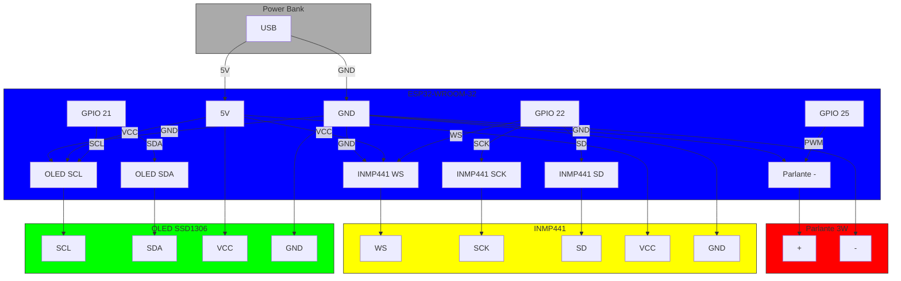

# \ud83d\udcbb Lista de Componentes de Hardware

**\ud83d\udc31 F\u00e9lix v2.0** | **\u00daltima actualizaci\u00f3n: 2024-09-28**

Este documento detalla **todos los componentes de hardware** necesarios para construir a F\u00e9lix, incluyendo alternativas, precios aproximados y enlaces de compra.

---

## \ud83c\udf0d Tabla de Contenidos
1. [Lista de Componentes](#-lista-de-componentes)
2. [Diagrama de Conexiones](#-diagrama-de-conexiones)
3. [Alternativas y Recomendaciones](#-alternativas-y-recomendaciones)
4. [Donde Comprar](#-donde-comprar)
5. [Herramientas Necesarias](#-herramientas-necesarias)

---

## \ud83d\udccb Lista de Componentes

### \u2705 **Componentes B\u00e1sicos (Obligatorios)**

| # | Componente | Modelo | Cantidad | Precio (USD) | Función | Protocolo |
|---|------------|--------|----------|--------------|---------|-----------|
| 1 | **Microcontrolador** | ESP32-WROOM-32 | 1 | $8 - $12 | Cerebro del sistema | - |
| 2 | **Pantalla OLED** | SSD1306 0.96" I2C | 1 | $3 - $6 | Mostrar expresiones de Félix | I2C |
| 3 | **Micrófono** | INMP441 I2S | 1 | $2 - $4 | Capturar voz del usuario | I2S |
| 4 | **Parlante** | 4Ω 3W | 1 | $2 - $5 | Reproducir voz de Félix | PWM |
| 5 | **Protoboard** | 400 puntos | 1 | $5 - $10 | Montaje de componentes | - |
| 6 | **Cables Jumper** | Macho-Hembra | 20 | $3 - $6 | Conexiones | - |
| 7 | **Fuente de Poder** | Power Bank 5V/2A | 1 | $10 - $20 | Alimentación | USB |

**Total estimado (básico):** **$33 - $63 USD**

---

### \u26a1 **Componentes Opcionales (Mejoras)**

| # | Componente | Modelo | Cantidad | Precio (USD) | Función | Protocolo |
|---|------------|--------|----------|--------------|---------|-----------|
| 8 | **Amplificador de Audio** | PAM8403 | 1 | $2 - $4 | Mejorar calidad de audio | - |
| 9 | **Batería LiPo** | 18650 3.7V | 1 | $8 - $15 | Alimentación portátil | - |
| 10 | **Módulo Bluetooth** | HC-05 | 1 | $5 - $8 | Alternativa a Bluetooth del ESP32 | UART |
| 11 | **Sensor de Tacto** | Capacitivo | 1 | $1 - $3 | Detector de caricias | GPIO |
| 12 | **LED RGB** | WS2812B | 1 | $1 - $2 | Indicador de estado | PWM |
| 13 | **Carcasa 3D** | Impresión 3D | 1 | $10 - $30 | Cuerpo de Félix | - |

**Total estimado (con mejoras):** **$62 - $135 USD**

---

## \ud83c\udfa8 Diagrama de Conexiones

### Conexiones del ESP32

### Tabla de Pines del ESP32

| Componente | Pin ESP32 | Tipo | Notas |
|------------|-----------|------|-------|
| OLED SCL | GPIO 21 | Salida | I2C Clock |
| OLED SDA | GPIO 22 | Salida/Entrada | I2C Data |
| INMP441 WS | GPIO 23 | Salida | I2S Word Select |
| INMP441 SCK | GPIO 24 | Salida | I2S Clock |
| INMP441 SD | GPIO 25 | Entrada | I2S Data |
| Parlante | GPIO 26 | Salida | PWM |
| Bluetooth | - | - | Integrado en ESP32 |

---

## \ud83d\udc68 Alternativas y Recomendaciones

### Microcontroladores
| Modelo | Pros | Contras | Precio | Compatibilidad |
|--------|------|---------|--------|----------------|
| **ESP32-WROOM-32** | WiFi + Bluetooth, popular, buena documentación | - | $8-$12 | \u2705 Recomendado |
| ESP32-S3 | Más memoria, USB nativo | Menos soporte en librerías | $10-$15 | \u2705 Bueno |
| ESP32-C3 | WiFi + Bluetooth 5.0 | Menos GPIO | $8-$12 | \u2705 Bueno |
| Raspberry Pi Pico W | Más potente, MicroPython | No Bluetooth nativo | $10 | \u274c No recomendado |

**Recomendación:** **ESP32-WROOM-32** (el más probado y con mejor soporte).

---

### Pantallas OLED
| Modelo | Tamaño | Resolución | Protocolo | Precio | Notas |
|--------|--------|------------|-----------|--------|-------|
| **SSD1306** | 0.96" | 128x64 | I2C | $3-$6 | \u2705 Recomendado |
| SH1106 | 1.3" | 128x64 | I2C | $5-$8 | Más grande, mismo precio |
| SSD1309 | 1.3" | 128x64 | SPI/I2C | $7-$10 | Mejor contraste |

**Recomendación:** **SSD1306 0.96"** (el más común y económico).

---

### Micrófonos
| Modelo | Tipo | Protocolo | Sensibilidad | Precio | Notas |
|--------|------|-----------|--------------|--------|-------|
| **INMP441** | MEMS | I2S | Alta | $2-$4 | \u2705 Recomendado |
| MAX44660 | Electret | Analógico | Media | $3-$5 | Requiere amplificador |
| MAX9814 | Electret | Analógico | Media | $2-$4 | Más simple |

**Recomendación:** **INMP441** (mejor calidad y compatibilidad con I2S).

---

### Parlantes
| Modelo | Impedancia | Potencia | Tamaño | Precio | Notas |
|--------|------------|----------|--------|--------|-------|
| **4Ω 3W** | 4Ω | 3W | 40mm | $2-$5 | \u2705 Recomendado |
| 8Ω 0.5W | 8Ω | 0.5W | 30mm | $1-$3 | Menos potencia |
| 4Ω 5W | 4Ω | 5W | 50mm | $5-$8 | Más grande |

**Recomendación:** **4Ω 3W** (buen equilibrio entre tamaño y calidad).

---

## \ud83d\udccd Donde Comprar

### Tiendas Internacionales
| Tienda | Enlace | Notas |
|--------|--------|-------|
| **AliExpress** | [www.aliexpress.com](https://www.aliexpress.com) | Precios bajos, envío lento |
| **Amazon** | [www.amazon.com](https://www.amazon.com) | Envío rápido, precios variables |
| **LCSC** | [www.lcsc.com](https://www.lcsc.com) | Componentes electrónicos |
| **Digi-Key** | [www.digikey.com](https://www.digikey.com) | Amplio catálogo, envío rápido |
| **Mouser** | [www.mouser.com](https://www.mouser.com) | Componentes de calidad |
| **SparkFun** | [www.sparkfun.com](https://www.sparkfun.com) | Kits y tutoriales |
| **Adafruit** | [www.adafruit.com](https://www.adafruit.com) | Buen soporte y guías |

### Tiendas por País

#### \ud83c\uddee\ud83c\uddea **Colombia**
| Tienda | Enlace | Notas |
|--------|--------|-------|
| **Mercado Libre** | [www.mercadolibre.com.co](https://www.mercadolibre.com.co) | Envío local |
| **Linio** | [www.linio.com.co](https://www.linio.com.co) | Variedad de productos |
| **Electrónica RC** | [www.electronicarcto.com](https://www.electronicarcto.com) | Componentes electrónicos |

#### \ud83c\uddea\ud83c\uddf8 **España**
| Tienda | Enlace | Notas |
|--------|--------|-------|
| **Amazon España** | [www.amazon.es](https://www.amazon.es) | Envío rápido |
| **Electrónica Picasa** | [www.picasa-electronica.com](https://www.picasa-electronica.com) | Componentes para makers |

#### \ud83c\uddee\ud83c\uddf7 **México**
| Tienda | Enlace | Notas |
|--------|--------|-------|
| **Mercado Libre México** | [www.mercadolibre.com.mx](https://www.mercadolibre.com.mx) | Envío local |
| **Amazon México** | [www.amazon.com.mx](https://www.amazon.com.mx) | Envío rápido |

#### \ud83c\udde7\ud83c\uddf7 **Argentina**
| Tienda | Enlace | Notas |
|--------|--------|-------|
| **Mercado Libre Argentina** | [www.mercadolibre.com.ar](https://www.mercadolibre.com.ar) | Envío local |
| **Electrónica Venex** | [www.venex.com.ar](https://www.venex.com.ar) | Componentes electrónicos |

---

## \ud83d\udc7c Herramientas Necesarias

### Herramientas Básicas
| Herramienta | Descripción | Precio (USD) | Opcional |
|-------------|-------------|--------------|----------|
| **Soldador** | 30W-60W | $10-$20 | \u274c No (se usa protoboard) |
| **Pasta para soldar** | - | $5 | \u274c No |
| **Cautín** | - | - | \u2705 Sí (si se suelda) |
| **Multímetro** | Medir voltaje, corriente | $15-$50 | \u2705 Sí |
| **Pinzas** | Cortar y pelar cables | $5-$10 | \u2705 Sí |
| **Destornillador** | Ajustar tornillos | $5 | \u2705 Sí |

### Software Necesario
| Software | Descripción | Enlace | Plataforma |
|----------|-------------|--------|------------|
| **Arduino IDE** | Programar ESP32 | [arduino.cc](https://www.arduino.cc) | Windows/macOS/Linux |
| **PlatformIO** | Alternativa a Arduino IDE | [platformio.org](https://platformio.org) | Windows/macOS/Linux |
| **Thonny** | IDE para MicroPython | [thonny.org](https://thonny.org) | Windows/macOS/Linux |
| **Python 3.9+** | Para la app móvil | [python.org](https://python.org) | Windows/macOS/Linux |
| **Buildozer** | Compilar app para Android | [buildozer.dev](https://buildozer.dev) | Windows/macOS/Linux |
| **Fritzing** | Diseñar diagramas | [fritzing.org](https://fritzing.org) | Windows/macOS/Linux |

---

## \ud83d\udc81 Guía de Compra Rápida

### Opción 1: Kit Básico (Mínimo)
| Componente | Modelo | Cantidad | Precio (USD) | Total |
|------------|--------|----------|--------------|-------|
| ESP32-WROOM-32 | - | 1 | $10 | $10 |
| OLED SSD1306 0.96" | - | 1 | $5 | $15 |
| INMP441 | - | 1 | $3 | $18 |
| Parlante 4Ω 3W | - | 1 | $3 | $21 |
| Protoboard 400 | - | 1 | $5 | $26 |
| Cables Jumper | - | 20 | $4 | $30 |
| Power Bank | - | 1 | $10 | **$40** |

**Total: ~$40 USD**

### Opción 2: Kit Recomendado (Con Mejoras)
| Componente | Modelo | Cantidad | Precio (USD) | Total |
|------------|--------|----------|--------------|-------|
| ESP32-WROOM-32 | - | 1 | $10 | $10 |
| OLED SH1106 1.3" | - | 1 | $7 | $17 |
| INMP441 | - | 1 | $3 | $20 |
| Parlante 4Ω 3W | - | 1 | $3 | $23 |
| Amplificador PAM8403 | - | 1 | $3 | $26 |
| Protoboard 800 | - | 1 | $8 | $34 |
| Cables Jumper | - | 30 | $6 | $40 |
| Power Bank | - | 1 | $15 | $55 |
| LED RGB WS2812B | - | 1 | $2 | **$57** |

**Total: ~$57 USD**

---

## \ud83d\udc31 \u00bfPreguntas Frecuentes?

### \u2753 ¿Puedo usar otros componentes?
**Sí**, pero asegúrate de que sean **compatibles** con el ESP32 y el firmware de Félix. Si usas alternativas, puede que necesites modificar el código.

### \u2753 ¿Dónde puedo comprar los componentes en mi país?
Consulta la sección **[Donde Comprar](#-donde-comprar)** o busca en **Mercado Libre** o **Amazon** de tu país.

### \u2753 ¿Necesito soldar?
**No**, el diseño actual usa **protoboard y cables jumper**, por lo que no es necesario soldar. Sin embargo, si quieres un montaje más permanente, puedes soldar los componentes.

### \u2753 ¿Puedo usar una Raspberry Pi en lugar del ESP32?
**No recomendado**. El proyecto está optimizado para **ESP32** (bajo consumo, Bluetooth integrado). Si quieres usar una Raspberry Pi, tendrías que reescribir gran parte del firmware.

### \u2753 ¿Puedo usar un micrófono analógico?
**Sí**, pero necesitarás un **convertidor ADC** (el ESP32 tiene ADC integrado, pero la calidad no será tan buena como con el INMP441 I2S).

---

## \ud83d\udcc8 Recursos Adicionales

- [Hoja de datos del ESP32-WROOM-32](https://www.espressif.com/sites/default/files/documentation/esp32-wroom-32_datasheet_en.pdf)
- [Hoja de datos del SSD1306](https://cdn-shop.adafruit.com/datasheets/SSD1306.pdf)
- [Hoja de datos del INMP441](https://www.invensense.com/wp-content/uploads/2015/02/INMP441.pdf)
- [Guía de conexión I2C en ESP32](https://docs.espressif.com/projects/esp-idf/en/latest/esp32/api-reference/peripherals/i2c.html)
- [Guía de conexión I2S en ESP32](https://docs.espressif.com/projects/esp-idf/en/latest/esp32/api-reference/peripherals/i2s.html)

---

**\ud83d\udc31 F\u00e9lix te espera... ¡Es hora de construirlo! \ud83d\udc3e**

[\u2190 Volver a Hardware](hardware) | [\ud83d\udc82 Ver Assembly Guide \u2192](assembly.md)
